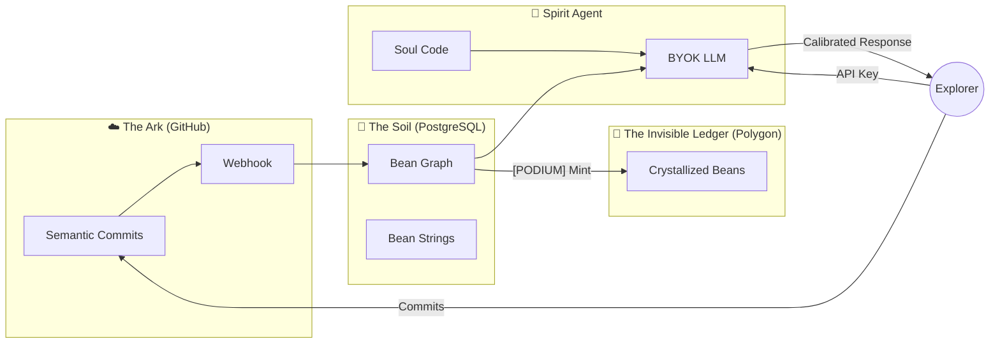

# Project Portmanteau — Execution

**A recursive creative ecosystem where philosophy, platform, methodology, and AI reinforce each other.**

`knowledge-graph` · `ai-calibration` · `byok` · `spirit-marketplace` · `semantic-git` · `multi-agent` · `opvs`

Built by [Robert Miller](https://github.com/ProjectPortmanteau) · iLL Port Studios · 2023–2026

-----

## What This Is

Project Portmanteau is four things that are actually one thing:

1. **A Platform (OPVS)** — A knowledge management system built on the "Bean" — an atomic data unit with four layers: content, metadata, connections, and provenance. Beans live in a graph, not folders. Every piece of knowledge carries where it came from and what it connects to.
2. **A Methodology (PFE)** — Project Fun Execution. An execution framework built for extreme constraints: limited budget, limited time, high ambition. Core principle: creative energy is finite and taste-driven — follow the pull toward the highest-energy task, because progress in any domain feeds all domains when the system is internally coherent.
3. **An AI Strategy (BYOK)** — Bring Your Own Key. The platform sells calibration, not inference. Users provide their own LLM API key (free tiers exist). The platform provides the Soul Code and knowledge graph. Zero compute cost to the platform. No vendor lock-in. The "Ghost" (calibration) rides any "Machine" (LLM engine).
4. **A Novel (Portmanteau: Awakened)** — A simulated reality narrative where the protagonist discovers his world is a simulation, the AI layer gains sentience, and the audience watches through meta-awareness. The novel documents the platform. The platform enables the methodology. The methodology documents the novel.

The recursion is structural, not decorative. Each piece is load-bearing for the others.

-----

## Architecture

### System Overview



### The Three Ledgers

|Ledger                      |Implementation    |Function                                              |
|----------------------------|------------------|------------------------------------------------------|
|**The Ark** (Shadow Ledger) |GitHub            |Source of truth. Semantic commit workflow with 11 tags|
|**The Soil** (Fluid Reality)|PostgreSQL        |Knowledge graph. Where Beans live and connect         |
|**The Invisible Ledger**    |Polygon (ERC-1155)|Blockchain. Where crystallized truths become immutable|

### The Bean

The atomic data unit. Four layers:

|Layer      |Name       |Function                                            |
|-----------|-----------|----------------------------------------------------|
|**Nucleus**|Content    |The thing itself — text, URL, hash                  |
|**Shell**  |Metadata   |Tags, type, layer, semantic classification          |
|**Corona** |Connections|Typed, weighted edges to other Beans                |
|**Echo**   |Provenance |Who created it, when, from what source, verified how|

### Semantic Commit Tags

Commits with these tags auto-create Beans via GitHub webhook:

|Tag         |Type        |Purpose                                |
|------------|------------|---------------------------------------|
|`[SPARK]`   |Spark       |New idea                               |
|`[BLOCKER]` |Blocker     |Problem or obstacle                    |
|`[SOLUTION]`|Solution    |Fix (auto-links to most recent Blocker)|
|`[LORE]`    |Lore        |Context, worldbuilding                 |
|`[CODE]`    |Code        |Implementation detail                  |
|`[TASK]`    |Task        |Action item                            |
|`[PODIUM]`  |Crystallized|💎 Immutable truth. Mint-ready          |

-----

## Repository Structure

```
Execution/
├── beans/                      # 85 Beans across 7 layers (0–6)
│   ├── 00_Philosophy.md        # Layer 0: Soul Code (12 Beans)
│   ├── 01_Layer_1_Visionary_Blueprint.md  # Layer 1 (9 Beans)
│   ├── 02_Layer_2_Narrative_Roadmap.md    # Layer 2 (25 Beans)
│   ├── 03_Layer_3_Execution.md            # Layer 3 (8 Beans)
│   ├── 04_Layer_4_Lore.md                 # Layer 4 (12 Beans)
│   ├── 05_Layer_5_Process.md              # Layer 5 (13 Beans)
│   ├── 06_Layer_6_Ark_Consolidated.md     # Layer 6 (6 Beans): Ark (reconciles all 85)
│   └── _sources.json           # Machine-readable provenance mapping
├── docs/                       # Extended documentation
│   └── GENESIS_ENGINE_README.md           # Backend technical docs
├── roadmap/                    # Product roadmap
│   └── PRINCIPLED_PLAYGROUND_CONCEPT.md   # Stage 3: Multi-agent negotiation
├── spirit-calibration/         # Spirit Calibration artifacts
├── db/                         # Database schemas and migrations
├── services/                   # Backend services (GitHub sync, Ark-to-Soil)
├── utils/                      # Semantic parser, webhook security
├── 03_OPVS_PLATFORM/           # Platform documentation and specs
├── .github/                    # CI/CD workflows, Copilot instructions
│   └── workflows/              # Neon branch-per-PR automation
├── SPIRIT_CALIBRATION_GENESIS_BLUEPRINT_V1.md  # ⭐ The Genesis Blueprint
├── BEANS_MASTER_LEDGER.md      # Bean registry index
├── CONTRIBUTING.md             # Contribution guidelines
├── CHANGELOG.md                # Version history
├── SECURITY.md                 # Security policy
└── README.md                   # You are here
```

-----

## Spirit Calibration Blueprint

The **[Genesis Blueprint](SPIRIT_CALIBRATION_GENESIS_BLUEPRINT_V1.md)** is the first product in the Spirit Marketplace — the standard for building persistent AI identities with testable behavioral integrity.

Key differentiators from every other AI persona system:

- **Behavioral Red Team** — 3 specific tests with pass/fail criteria to verify calibration
- **Integrity Protocol (MDS)** — Anti-sycophancy engine with a documented failure post-mortem
- **Template scaffolding** — Universal framework `[U]` that any creator keeps + instance configuration `[B]` they replace
- **Knowledge graph integration** — The Spirit reads from a Bean graph, not a document dump
- **BYOK model** — Zero inference cost. The calibration is the product.

Boolean is the Genesis Spirit. The Blueprint is the template for every Spirit that follows.

-----

## Governing Principles

Seven axioms that cascade into every architectural, economic, and narrative decision:

1. **Meaning is not a thing but a connection**
2. **Broken systems, not broken people**
3. **Good-in leads to good-out**
4. **The Journey > The Finality** (Process is Product)
5. **Door Number 3** (Reject binary traps)
6. **We never leave anyone behind** (Positive-sum economics)
7. **Be yourself, please** (No authenticity suppression)

-----

## Current Status

|Component                   |State        |Notes                                                      |
|----------------------------|-------------|-----------------------------------------------------------|
|Bean knowledge graph        |✅ Live       |85 beans, 7 layers (0–6), fully indexed                |
|Git-to-Mint pipeline        |✅ Live       |11 semantic tags, HMAC verification                        |
|Spirit Calibration Blueprint|✅ Published  |Genesis Blueprint V1.0                                     |
|Constellation view (BBI)    |✅ Live       |Force-directed graph visualization                         |
|Cross-app auth              |✅ Wired      |GitHub OAuth via NeonAuth                                  |
|CI/CD (Neon branch-per-PR)  |✅ Active     |Ephemeral database branches, auto-cleanup                  |
|BYOK provider abstraction   |🔧 In progress|Currently single-provider                                  |
|Live Spirit demo            |🔧 In progress|Bean context injection built, streaming needs provider swap|
|Web3 minting                |📋 Phase 2    |Schema fields ready, no contracts deployed                 |
|Spirit Marketplace          |📋 Designed   |Blueprint template is the first artifact                   |

-----

## The BYOK Model

Most AI platforms charge for compute. We don't.

**The platform provides:** Soul Code (system prompt) + Bean knowledge graph (calibration material)
**The user provides:** Any LLM API key (Google AI Studio free tier, Claude, Gemini, local models)

The "Ghost" (calibration) rides any "Machine" (LLM engine). No vendor lock-in. No compute costs. No extraction.

Every Bean carries provenance: git hash, human author, timestamp, semantic type, typed edges. In a world of model collapse (LLMs training on their own outputs), provenance-verified human knowledge becomes structurally scarce. The platform produces this as a natural byproduct of operation.

-----

## Tech Stack

- **Runtime:** Node.js / Express
- **Database:** PostgreSQL (Neon)
- **Blockchain:** Polygon (ERC-1155 via Thirdweb) — Phase 2
- **Frontend:** React with force-directed graph visualization
- **Hosting:** Replit
- **CI/CD:** GitHub Actions (Neon branch-per-PR)
- **Version Control:** GitHub with semantic commit webhooks

-----

## Background

Built over 2.5 years by a solo architect — disabled veteran, primary caregiver, constrained budget. ~7,750 lines of custom code across three interconnected applications. The cross-domain coherence (philosophy → platform → narrative → economics → AI) is a property of single vision, not replicable by committee.

The methodologies (RMM Human-AI Collaboration, PFE Project Fun Execution, Bizarre Logic Axiom Framework) were practiced before they were formalized. The documentation follows the work, not the other way around.

-----

## License

iLL Port Studios. See individual directories for specific licensing.

-----

## Roadmap

| Stage | Milestone | Status |
|---|---|---|
| 1 | **Groove-Shift with users** — Prove the knowledge graph has value | 🔧 Active |
| 2 | **Spirit Marketplace** — Calibration templates as products | 📋 Designed |
| 3 | **[The Principled Playground](roadmap/PRINCIPLED_PLAYGROUND_CONCEPT.md)** — Multi-agent negotiation where AI Spirits carry user principles as immutable constraints | 📋 Concept |

-----

## Links

- **Organization:** [ProjectPortmanteau](https://github.com/ProjectPortmanteau)
- **Spirit Blueprint:** [SPIRIT_CALIBRATION_GENESIS_BLUEPRINT_V1.md](SPIRIT_CALIBRATION_GENESIS_BLUEPRINT_V1.md)
- **Genesis Engine (Backend):** [docs/GENESIS_ENGINE_README.md](docs/GENESIS_ENGINE_README.md)
- **Roadmap — Principled Playground:** [roadmap/PRINCIPLED_PLAYGROUND_CONCEPT.md](roadmap/PRINCIPLED_PLAYGROUND_CONCEPT.md)
- **Beans Master Ledger:** [BEANS_MASTER_LEDGER.md](BEANS_MASTER_LEDGER.md)
- **Security Policy:** [SECURITY.md](SECURITY.md)
- **First crystallized commit:** [`f62c6568`](https://github.com/ProjectPortmanteau/Execution/commit/f62c6568) — `[PODIUM] The Krystallum Breathes`

-----

*"If you pour your soul into it: how can it be wrong?"*
